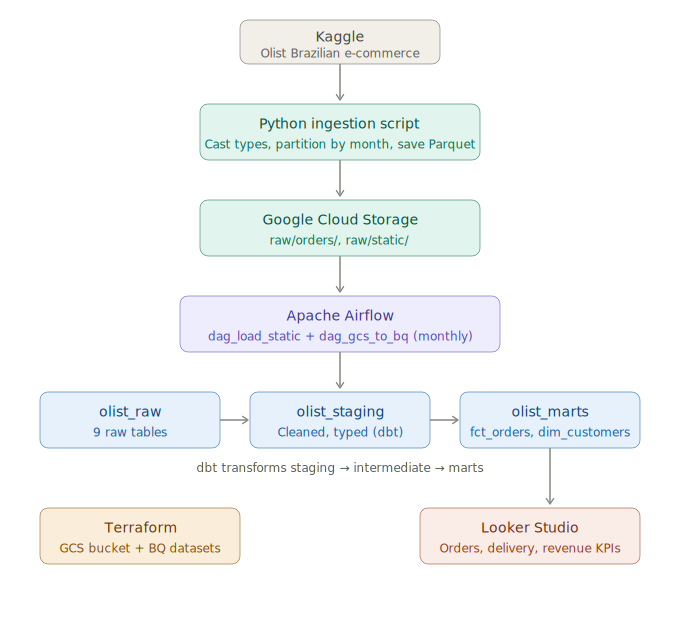

# E-Commerce Data Pipeline

A production-grade batch data pipeline built on GCP that ingests, transforms, and analyzes the [Olist Brazilian E-Commerce dataset](https://www.kaggle.com/datasets/olistbr/brazilian-ecommerce) from Kaggle.

## Problem Statement

Build a scalable batch data pipeline on GCP to ingest, transform, and analyze Olist e-commerce data — enabling visibility into order trends, delivery performance, and seller revenue through a structured data warehouse and dashboard.

## Architecture



## Architecture
```
Kaggle (Source)
      ↓
Python Ingestion Script (partitions CSVs by month → Parquet)
      ↓
Google Cloud Storage (raw partitioned files)
      ↓
Apache Airflow (orchestrates pipeline on monthly schedule)
      ↓
BigQuery (olist_raw → olist_staging → olist_intermediate → olist_marts)
      ↓
dbt (transforms and models data)
      ↓
Looker Studio (dashboard)
```

## Tech Stack

| Layer | Tool |
|---|---|
| Source | Kaggle Olist Dataset |
| Ingestion | Python + pandas |
| Cloud Storage | Google Cloud Storage |
| Infrastructure | Terraform |
| Orchestration | Apache Airflow (Docker Compose) |
| Warehouse | BigQuery |
| Transformation | dbt |
| BI | Looker Studio |
| Reproducible Env | GitHub Codespaces |
| CI/CD | GitHub Actions |

## Project Structure
```
e-commerce-data-pipeline/
    .devcontainer/          # GitHub Codespaces config
    ingestion/              # Ingestion scripts
    airflow/                # Airflow DAGs and Docker Compose
    dbt/                    # dbt models
    terraform/              # GCP infrastructure as code
```

## Prerequisites

- GitHub account with Codespaces access
- GCP account with billing enabled
- Kaggle account with API access

## Setup

### 1. Fork and open in Codespaces

Fork this repo and open it in GitHub Codespaces.

### 2. Add Codespaces secrets

Go to **Settings → Secrets and variables → Codespaces** and add:

| Secret | Description |
|---|---|
| `GCP_SERVICE_ACCOUNT_KEY` | GCP service account key JSON |
| `GCS_BUCKET_NAME` | GCS bucket name |
| `GCP_PROJECT_ID` | GCP project ID |
| `KAGGLE_USERNAME` | Kaggle username |
| `KAGGLE_KEY` | Kaggle API key |

### 3. Provision infrastructure
```bash
cd terraform
terraform init
terraform plan
terraform apply
```

This creates:
- GCS bucket for raw data
- BigQuery datasets: `olist_raw`, `olist_staging`, `olist_intermediate`, `olist_marts`

### 4. Run ingestion
```bash
python ingestion/partition_and_upload.py
```

This downloads the Olist dataset from Kaggle, partitions transactional files by month, and uploads all files to GCS as Parquet.

### 5. Start Airflow
```bash
cd airflow
docker compose up -d
```

Access the Airflow UI at `http://localhost:8080` (username: `admin`, password: `admin`).

### 6. Trigger DAGs

Run in this order:

1. **`dag_load_static`** — loads dimension tables once (customers, sellers, products etc.)
2. **`dag_gcs_to_bq`** — loads partitioned tables monthly (orders, order_reviews)

## Data Flow

### GCS Structure
```
gs://e-commerce-pipeline-raw/
    raw/
        orders/
            orders_2016-09.parquet
            orders_2016-10.parquet
            ...
        order_reviews/
            order_reviews_2016-10.parquet
            ...
        static/
            customers.parquet
            sellers.parquet
            products.parquet
            order_items.parquet
            order_payments.parquet
            geolocation.parquet
            category_translation.parquet
```

### BigQuery Datasets

| Dataset | Description |
|---|---|
| `olist_raw` | Raw data loaded directly from GCS |
| `olist_staging` | Cleaned and typed data (dbt) |
| `olist_intermediate` | Joined and enriched models (dbt) |
| `olist_marts` | Business-level models for dashboards (dbt) |

## Status

- [x] Ingestion layer
- [x] Infrastructure (Terraform)
- [x] Airflow DAGs
- [x] Raw data in BigQuery
- [ ] dbt models
- [ ] Looker Studio dashboard
- [ ] CI/CD