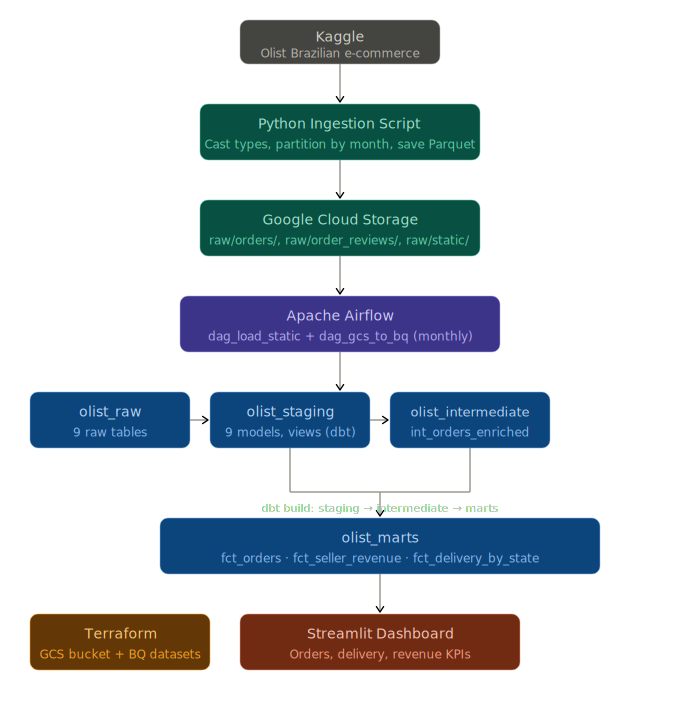
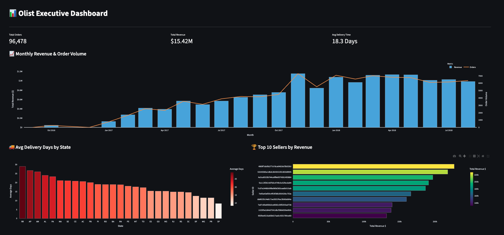

# E-Commerce Data Pipeline

A production-grade batch data pipeline built on GCP that ingests, transforms, and analyzes the [Olist Brazilian E-Commerce dataset](https://www.kaggle.com/datasets/olistbr/brazilian-ecommerce) from Kaggle.

## Problem Statement

Build a scalable batch data pipeline on GCP to ingest, transform, and analyze Olist e-commerce data — enabling visibility into order trends, delivery performance, and seller revenue through a structured data warehouse and dashboard.

## Architecture



```
Kaggle (Source)
      ↓
Python Ingestion Script (partitions CSVs by month → Parquet)
      ↓
Google Cloud Storage (raw partitioned files)
      ↓
Apache Airflow (orchestrates pipeline on monthly schedule)
      ↓
BigQuery (olist_raw → olist_staging → olist_intermediate → olist_marts)
      ↓
dbt Core (transforms and models data, runs tests)
      ↓
Streamlit (interactive dashboard)
```

## Tech Stack

| Layer | Tool |
|---|---|
| Source | Kaggle Olist Dataset |
| Ingestion | Python + pandas |
| Cloud Storage | Google Cloud Storage |
| Infrastructure | Terraform |
| Orchestration | Apache Airflow (Docker Compose) |
| Warehouse | BigQuery |
| Transformation | dbt Core |
| Dashboard | Streamlit + Plotly |
| Reproducible Env | GitHub Codespaces |

## Project Structure

```
e-commerce-data-pipeline/
    .devcontainer/          # GitHub Codespaces config
    ingestion/              # Ingestion scripts
    airflow/                # Airflow DAGs and Docker Compose
    dbt/                    # dbt project (profiles.yml + olist/)
        olist/
            models/
                staging/    # 9 staging models (views)
                intermediate/  # int_orders_enriched
                marts/      # fct_orders, fct_seller_revenue, fct_delivery_by_state
    terraform/              # GCP infrastructure as code
    streamlit_app/          # Dashboard app
```

## Prerequisites

- GitHub account with Codespaces access
- GCP account with billing enabled
- Kaggle account with API access

## Setup

### 1. Fork and add Codespaces secrets

Fork this repo. Before opening in Codespaces, go to **Settings → Secrets and variables → Codespaces** and add:

| Secret | Description |
|---|---|
| `GCP_SERVICE_ACCOUNT_KEY` | GCP service account key JSON |
| `GCS_BUCKET_NAME` | GCS bucket name |
| `GCP_PROJECT_ID` | GCP project ID |
| `KAGGLE_USERNAME` | Kaggle username |
| `KAGGLE_KEY` | Kaggle API key |

### 2. Open in Codespaces

Open the forked repo in GitHub Codespaces. The dev container will automatically:
- Install all Python dependencies (including dbt)
- Install Terraform and Docker
- Write the GCP service account keyfile to `~/.gcp/keyfile.json`

### 3. Provision infrastructure

```bash
cd terraform
terraform init
terraform plan
terraform apply
```

This creates:
- GCS bucket for raw data
- BigQuery datasets: `olist_raw`, `olist_staging`, `olist_intermediate`, `olist_marts`

### 4. Run ingestion

```bash
python ingestion/partition_and_upload.py
```

This downloads the Olist dataset from Kaggle, partitions transactional files by month, and uploads all files to GCS as Parquet.

### 5. Start Airflow

```bash
cd airflow
docker compose up -d
```

Access the Airflow UI at `http://localhost:8080` (username: `admin`, password: `admin`).

### 6. Trigger DAGs

Run in this order:

1. **`dag_load_static`** — loads static dimension tables once (customers, sellers, products, order items, payments, geolocation). These never change and are not reprocessed.
2. **`dag_gcs_to_bq`** — runs monthly, loads partitioned `orders` and `order_reviews` tables, then automatically triggers `dbt build --select stg_orders+ stg_order_reviews` to transform and test only the models affected by new data.

> **Note:** After running `dag_load_static` for the first time, manually run `dbt build --select stg_customers stg_sellers stg_products stg_order_items stg_order_payments stg_geolocation stg_category_translation --target prod` once to populate static staging models in prod.

### 7. Run the dashboard

```bash
cd streamlit_app
streamlit run app.py
```

Access the dashboard at `http://localhost:8501`.

## Dashboard Preview



## Data Flow

### GCS Structure

```
gs://<your-bucket>/
    raw/
        orders/
            orders_2016-09.parquet
            orders_2016-10.parquet
            ...
        order_reviews/
            order_reviews_2016-10.parquet
            ...
        static/
            customers.parquet
            sellers.parquet
            products.parquet
            order_items.parquet
            order_payments.parquet
            geolocation.parquet
            category_translation.parquet
```

### BigQuery Datasets

| Dataset | Description |
|---|---|
| `olist_raw` | Raw data loaded directly from GCS |
| `olist_staging` | Cleaned and typed models — one per source table (views) |
| `olist_intermediate` | Joined and enriched models — `int_orders_enriched` |
| `olist_marts` | Business-level fact tables for dashboards |

### dbt Models

**Staging (9 models, views)** — light cleaning and type casting on top of raw tables. One model per source.

**Intermediate (1 model)** — `int_orders_enriched` joins orders with customers and computes delivery time in days.

**Marts (3 models, tables):**

| Model | Materialization | Description |
|---|---|---|
| `fct_orders` | Incremental (insert_overwrite), partitioned by month | Row-level orders with revenue. Powers monthly order and revenue trends. |
| `fct_delivery_by_state` | Table, clustered by state | Delivery time per order per state. Powers avg delivery time KPI. |
| `fct_seller_revenue` | Table, clustered by seller_id | Revenue per order item per seller. Powers top 10 sellers KPI. |

**Data Quality**: The project includes 28 dbt tests (schema tests, uniqueness, and relationship checks) that run as part of the dbt build command in Airflow to ensure data integrity before it reaches the Marts.

### KPIs

- **Total orders and revenue by month** — sourced from `fct_orders`
- **Average delivery time by state** — sourced from `fct_delivery_by_state`
- **Top 10 sellers by revenue** — sourced from `fct_seller_revenue`

## Pipeline Design Decisions

**Idempotency** — `dag_gcs_to_bq` deletes existing rows for the execution month before loading, making every DAG run safe to re-trigger without duplicating data.

**Incremental models** — `fct_orders` uses dbt's `insert_overwrite` incremental strategy, processing only the current month's partition on each run. Static dimension models are built once and not reprocessed.

**Storage Optimization**:
* **Partitioning**: `fct_orders` is partitioned by `order_purchase_timestamp` (monthly), enabling dbt's `insert_overwrite` strategy to replace data at the partition level, significantly reducing processing costs during backfills.
* **Clustering**: High-cardinality columns like `seller_id` and `state` are used for clustering in Marts to optimize filter performance for the Streamlit dashboard.

**Selective dbt execution** — Airflow runs `dbt build --select stg_orders+ stg_order_reviews` instead of rebuilding all models, avoiding unnecessary processing of static staging models on every monthly run.

## Status

- [x] Ingestion layer
- [x] Infrastructure (Terraform)
- [x] Airflow DAGs
- [x] Raw data in BigQuery
- [x] dbt models (staging, intermediate, marts)
- [x] Streamlit dashboard

## Acknowledgments

* **Data Source**: A special thanks to [Olist](https://olist.com/) for releasing this dataset and to [Kaggle](https://www.kaggle.com/datasets/olistbr/brazilian-ecommerce) for hosting it.
* **Community**: This project was developed as part of the [Data Engineering Zoomcamp](https://github.com/DataTalksClub/data-engineering-zoomcamp) provided by DataTalks.Club.